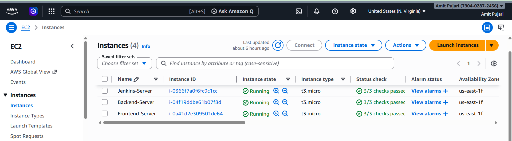
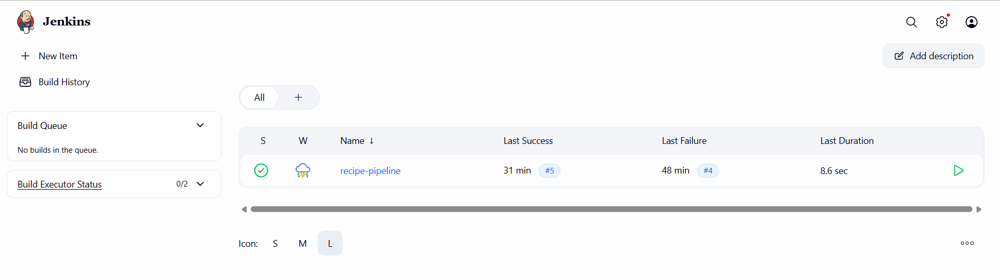
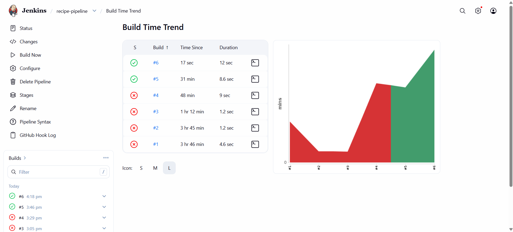
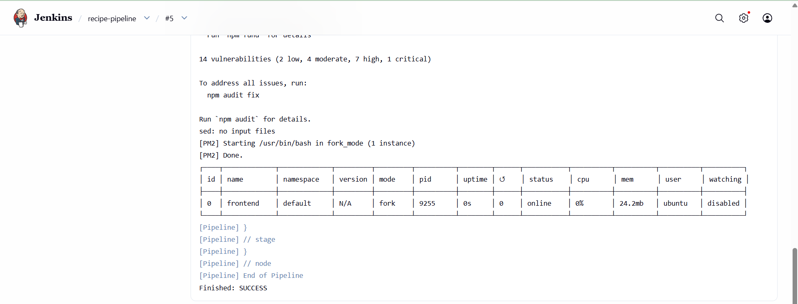
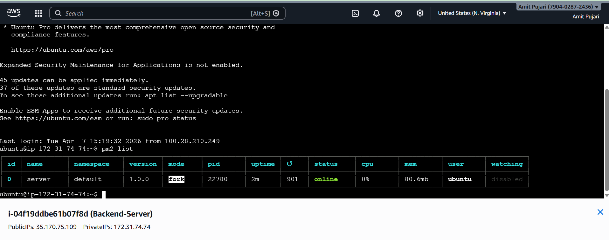
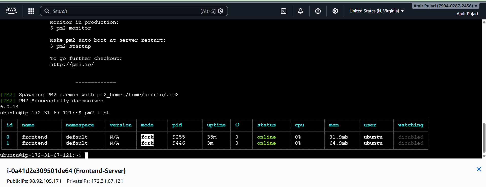
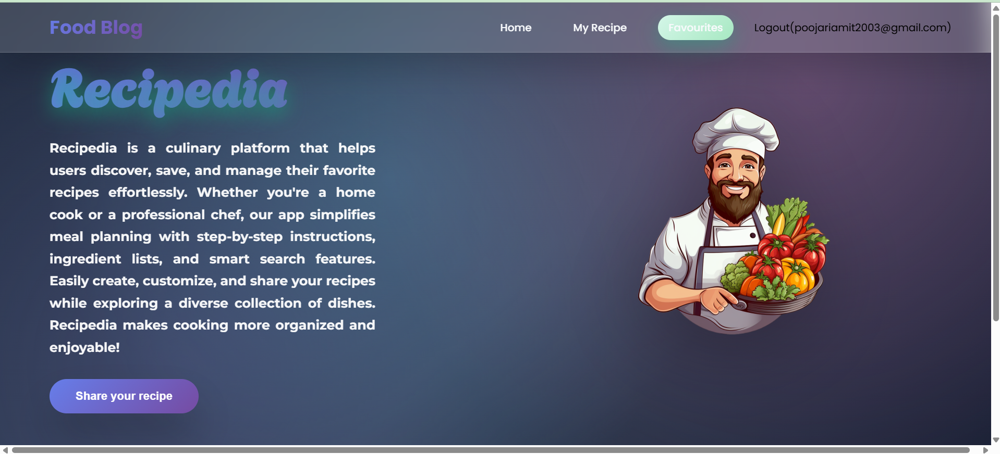
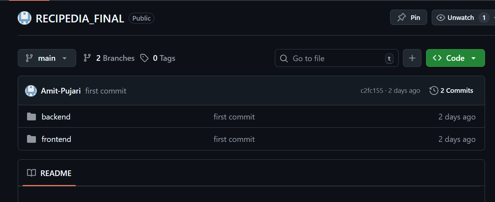

# 🚀 Recipedia DevOps Deployment (CI/CD using Jenkins & AWS)

## 📌 Project Overview

This project demonstrates automated deployment of a MERN stack application using a CI/CD pipeline. Jenkins is used to automate the build and deployment process, and AWS EC2 instances are used to host the application.

## 🛠️ Technologies Used

* Frontend: React.js
* Backend: Node.js + Express
* Database: MongoDB
* CI/CD: Jenkins
* Cloud: AWS EC2
* Process Manager: PM2
* Version Control: GitHub

## 🏗️ Architecture Flow

GitHub → Jenkins → Build → Deploy → Live Application

## ⚙️ Implementation Steps

### 1. Launch EC2 Instances

* Create 3 EC2 instances:

  * Jenkins Server
  * Backend Server
  * Frontend Server

### 2. Connect to EC2

ssh -i "your-key.pem" ubuntu@<PUBLIC-IP>

### 3. Install Node.js and PM2

sudo apt update
sudo apt install nodejs npm -y
sudo npm install -g pm2

### 4. Install Jenkins (On Jenkins Server)

sudo apt update
sudo apt install openjdk-17-jdk -y
sudo apt install jenkins -y
sudo systemctl start jenkins
sudo systemctl enable jenkins

### 5. Setup SSH Access

ssh-keygen
cat ~/.ssh/id_ed25519.pub
nano ~/.ssh/authorized_keys

### 6. Clone Project

git clone <your-repo-link>

### 7. Backend Setup

cd backend
npm install
pm2 start server.js

### 8. Frontend Setup

cd frontend
npm install
npm run build
pm2 start "serve -s dist -l 3000" --name frontend

### 9. Jenkins Pipeline (Backend Deployment)

ssh ubuntu@<backend-ip> "cd ~/RECIPEDIA_FINAL/backend && git pull && npm install && pm2 restart server || pm2 start server.js"

### 10. Jenkins Pipeline (Frontend Deployment)

ssh ubuntu@<frontend-ip> "cd ~/RECIPEDIA_FINAL/frontend && git pull && npm install && npm run build && pm2 restart frontend || pm2 start 'serve -s dist -l 3000' --name frontend"

## 📸 Screenshots

Refer to uploaded images in repository

## 🎯 Results

* Automated deployment using CI/CD
* Reduced manual effort
* Faster and reliable updates
* Application successfully running on AWS

## 📌 Conclusion

This project demonstrates how CI/CD using Jenkins and AWS can automate deployment and improve efficiency in real-world applications.

# 🚀 Recipedia DevOps Deployment (CI/CD using Jenkins & AWS)

## 📸 Project Screenshots with Description

---

### 🏗️ 1. AWS EC2 Instances Setup

This screenshot shows the creation of multiple EC2 instances used for Jenkins, Backend, and Frontend servers.

---

### ☁️ 2. EC2 Instances Running

All three EC2 instances are successfully running, representing the distributed architecture of the application.

---

### 🔐 3. SSH Connection Setup

Secure SSH connections are established between Jenkins and other servers for automated deployment.

---

### ⚙️ 4. Jenkins Dashboard

Jenkins dashboard showing the configured pipeline for CI/CD automation.

---

### 🔄 5. Jenkins Pipeline Execution

Pipeline execution process where Jenkins pulls code, installs dependencies, and deploys the application.

---

### ✅ 6. Backend Deployment (PM2)

Backend server is successfully running using PM2 process manager.

---

### 🌐 7. Frontend Deployment

Frontend application is built and served using a production-ready setup.

---

### 🚀 8. Live Application Output

Final deployed application accessible via public IP, demonstrating successful CI/CD implementation.

---
